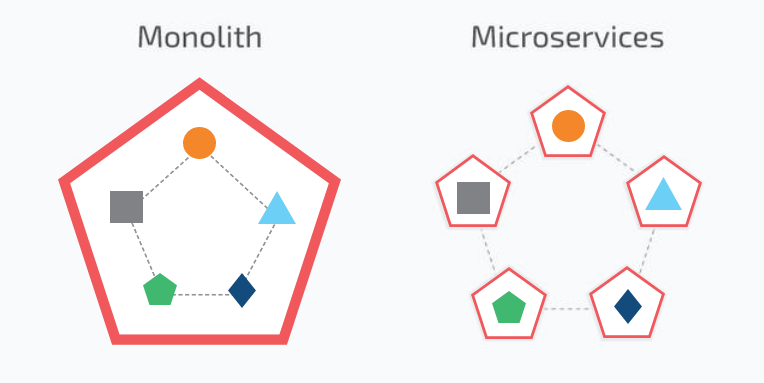

# Docker

### What is Docker
Docker is an open-source platform that is designed to be lightweight and simple. A Docker container is a standardized unit of software used to deploy applications. 

### Pros
- Containers are small compared to Virtual Machines
- Containers use less resources
- Fast boot
- Stable
- Eliminate the issues of "Works on my machine" (but not on different environmnet)
- Works well in DevOps and CI/CD

### Cons
- Security - Since there's no Operating System, security aspects of containers get overlooked
- Isolation - Containers use the same kernel so they are not completely isolated from each other
- Networking can be tricky when we want to limit access within containers and also have proper network communications
- Advances Quickly - Sometimes documentation change too quick, before the industry has a chance to adapt

### Background 

Docker is so popular today that “Docker” and “containers” are used interchangeably. But the first container-related technologies were available for years before Docker was released to the public in 2013. 

Most notably, in 2008, LinuXContainers (LXC) was implemented in the Linux kernel, fully enabling virtualization for a single instance of Linux. While LXC is still used today, newer technologies using the Linux kernel are available. Ubuntu, a modern, open-source Linux operating system, also provides this capability.

- Improved—and seamless—portability: While LXC containers often reference machine-specific configurations, Docker containers run without modification across any desktop, data center and cloud environment.

- Even lighter weight and more granular updates: With LXC, multiple processes can be combined within a single container. With Docker containers, only one process can run in each container. This makes it possible to build an application that can continue running while one of its parts is taken down for an update or repair.

- Automated container creation: Docker can automatically build a container based on application source code.

- Container versioning: Docker can track versions of a container image, roll back to previous versions, and trace who built a version and how. It can even upload only the deltas between an existing version and a new one.

- Container reuse: Existing containers can be used as base images—essentially like templates for building new containers.

- Shared container libraries: Developers can access an open-source registry containing thousands of user-contributed containers.

Docker adoption quickly exploded and continues to surge. 
Docker Inc. reports 11 million developers and 13 billion container image downloads every month

# Architecture

### Microservices

While a monolithic application is a single unified unit, a microservices architecture breaks it down into a collection of smaller independent units. 
These units carry out every application process as a separate service. 
So all the services have their own logic and the database as well as perform the specific functions.

# Running docker commands
- `docker run -d -p 4000:4000 docs/docker.github.io` (`-d` detached mode, `-p` for ports)
- After installation check `localhost:4000`
- docker ps
- Find the docs/docker id number
- `alias docker="winpty docker"`
- `docker exec -it 006c70b5600b sh` to ssh in
- `uname`
- `vi index.html`
- `docker stop 006c70b5600b` to stop the application from running in the background
- To replace a file while in running Docker container: `docker cp <src-path> <container>:<dest-path> `
- For example `docker cp C:/Users/Urbon/Desktop/Newfolder/index.html 9b6c62956864:usr/share/nginx/html/`
